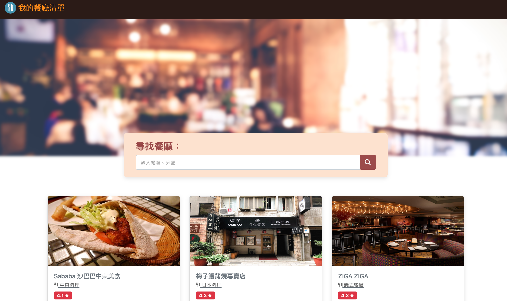

# [My Restaurant List](https://kumomiki.github.io/restaurant_list/)
A simple website which helps you to search restaurants. 

### Main Page


### Detail Page


## Introduction
+ You can search the restaurant by name, keyword and category.
+ You can see the rating of the restaurant.

## Features
1. Browse all restaurants.
2. Get more information of the restaurant on the show page, such as phone number, category and address.
3. Address can be linked to Google map.
4. Search the specific restaurant. 

## DevTools
+ Node.js 14.16.0
+ Express 4.16.4
+ Express-handlebars 3.0.0
+ Bootstrap 5.1.3
+ Font-Awesome 6.2.0

## How To Use
1. Make sure you do install node.js and npm.
2. Clone this project to your local computer.
```
$ git clone https://github.com/kumomiki/restaurant_list.git
```
3. Enter the folder of this project through Terminal
```
$ cd restaurant_list
```
4. Install npm
```
$ npm install
```
5. Install nodemon
```
$ npm install -g nodemon
```
6. Execute the app.js file
```
$ nodemon app.js
```
7. The message you receive below means 'the connection is running successfully'
```
Express is running on http://localhost:3000
```
8. Enjoy the website

